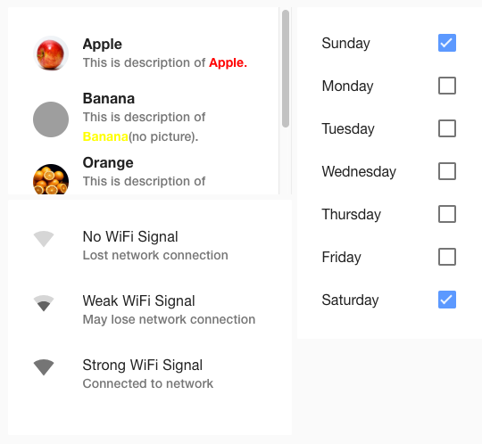

node-red-contrib-ui_list
========================

Node-RED widget node for showing items list.




Install
-------

Run the following command in your Node-RED user directory - typically `~/.node-red`

        npm install node-red-contrib-ui_list

Example
-------

```
[{"id":"8a9a24c0.00f5f8","type":"tab","label":"Example of ui_list","disabled":false,"info":""},{"id":"187bc9d3.2e3f46","type":"ui_list","z":"8a9a24c0.00f5f8","group":"6d50923f.f0b49c","name":"","order":1,"width":"6","height":"4","lineType":"two","actionType":"click","allowHTML":true,"showIcon":true,"x":290,"y":100,"wires":[["e6cff92d.0d4608"]]},{"id":"877c3a86.9420d8","type":"inject","z":"8a9a24c0.00f5f8","name":"Fruits","topic":"","payload":"[{\"title\":\"<b>Apple</b>\",\"description\":\"This is description of <font color=\\\"red\\\"><b>Apple</b></b>.\",\"icon\":\"https://upload.wikimedia.org/wikipedia/commons/thumb/1/15/Red_Apple.jpg/500px-Red_Apple.jpg\"},{\"title\":\"<b>Banana</b>\",\"description\":\"This is description of <font color=\\\"yellow\\\"><b>Banana</b></font>(no picture).\"},{\"title\":\"<b>Orange</b>\",\"description\":\"This is description of <font color=\\\"orange\\\"><b>Orange</b></font>.\",\"icon\":\"https://upload.wikimedia.org/wikipedia/commons/thumb/4/43/Ambersweet_oranges.jpg/440px-Ambersweet_oranges.jpg\"},{\"title\":\"<b>Watermelon</b>\",\"description\":\"This is description of <font color=\\\"green\\\"><b>Watermelon</b></font>.\",\"icon\":\"https://upload.wikimedia.org/wikipedia/commons/thumb/4/4c/Vampire_watermelon.jpg/440px-Vampire_watermelon.jpg\"}]","payloadType":"json","repeat":"","crontab":"","once":false,"onceDelay":0.1,"x":110,"y":100,"wires":[["187bc9d3.2e3f46"]]},{"id":"e6cff92d.0d4608","type":"debug","z":"8a9a24c0.00f5f8","name":"","active":true,"tosidebar":true,"console":false,"tostatus":false,"complete":"false","x":450,"y":100,"wires":[]},{"id":"64ebc713.983ee8","type":"inject","z":"8a9a24c0.00f5f8","name":"WiFi","topic":"","payload":"[{\"title\":\"No WiFi Signal\",\"description\":\"Lost network connection\",\"icon_name\":\"signal_wifi_0_bar\"},{\"title\":\"Weak WiFi Signal\",\"description\":\"May lose network connection\",\"icon_name\":\"signal_wifi_2_bar\"},{\"title\":\"Strong WiFi Signal\",\"description\":\"Connected to network\",\"icon_name\":\"signal_wifi_4_bar\"}]","payloadType":"json","repeat":"","crontab":"","once":false,"onceDelay":0.1,"x":110,"y":180,"wires":[["817f0a00.4d43c8"]]},{"id":"c7bcb105.ac9bb","type":"ui_list","z":"8a9a24c0.00f5f8","group":"6d50923f.f0b49c","name":"","order":3,"width":"4","height":"7","lineType":"one","actionType":"check","allowHTML":false,"showIcon":false,"x":290,"y":260,"wires":[["ef841ef7.03ff4"]]},{"id":"f296706f.42fdb","type":"inject","z":"8a9a24c0.00f5f8","name":"Day of Week","topic":"","payload":"[{\"title\":\"Sunday\",\"isChecked\":true},{\"title\":\"Monday\"},{\"title\":\"Tuesday\"},{\"title\":\"Wednesday\"},{\"title\":\"Thursday\"},{\"title\":\"Friday\"},{\"title\":\"Saturday\",\"isChecked\":true}]","payloadType":"json","repeat":"","crontab":"","once":false,"onceDelay":0.1,"x":130,"y":260,"wires":[["c7bcb105.ac9bb"]]},{"id":"ef841ef7.03ff4","type":"debug","z":"8a9a24c0.00f5f8","name":"","active":true,"tosidebar":true,"console":false,"tostatus":false,"complete":"false","x":450,"y":260,"wires":[]},{"id":"817f0a00.4d43c8","type":"ui_list","z":"8a9a24c0.00f5f8","group":"6d50923f.f0b49c","name":"","order":2,"width":"6","height":"5","lineType":"two","actionType":"none","allowHTML":true,"showIcon":true,"x":290,"y":180,"wires":[["ef65be08.50238"]]},{"id":"ef65be08.50238","type":"debug","z":"8a9a24c0.00f5f8","name":"","active":true,"tosidebar":true,"console":false,"tostatus":false,"complete":"false","x":450,"y":180,"wires":[]},{"id":"6d50923f.f0b49c","type":"ui_group","z":"","name":"Default","tab":"59347384.6ececc","disp":true,"width":"12","collapse":false},{"id":"59347384.6ececc","type":"ui_tab","z":"","name":"List","icon":"dashboard"}]
```
